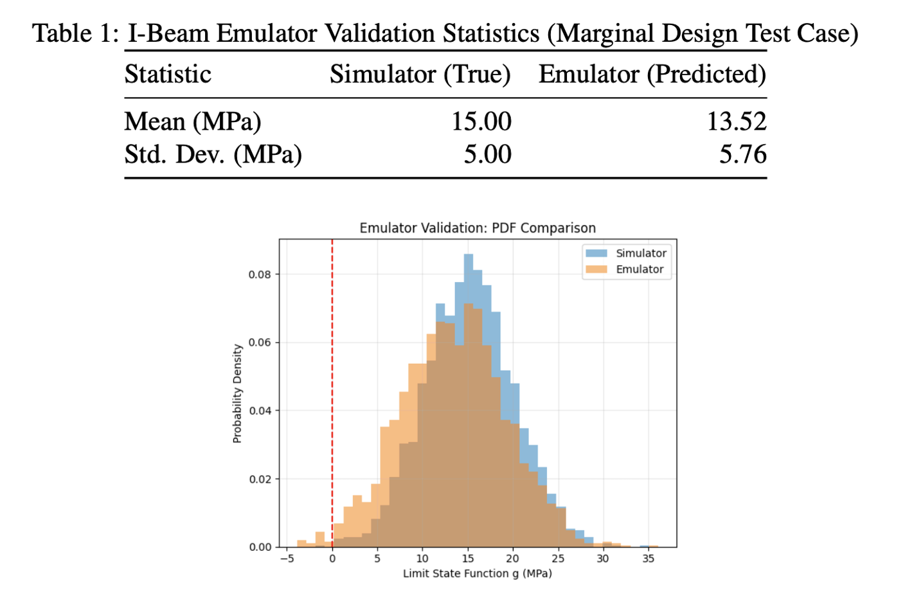

# Stochastic Emulator for Reliability-Based Design Optimization (RBDO)

## Overview

This project implements a **Generalized Lambda Model (GLaM)** emulator for efficient stochastic simulation and **Reliability-Based Design Optimization (RBDO)**. The emulator learns to predict full probability distributions of system responses, significantly reducing computational costs compared to traditional Monte Carlo methods.

## Project Structure

The implementation is organized in three phases:

### Phase 1: Proof of Concept - Geometric Brownian Motion (GBM)
- Validates the GLaM emulator on a simple financial model
- Simulates asset prices using GBM: $dS_t = \mu S_t dt + \sigma S_t dW_t$
- Compares emulated distributions against analytical lognormal solutions
- Demonstrates moment matching and distribution fidelity

### Phase 2: Engineering Application - I-Beam Structural Analysis
- Trains the emulator on a realistic structural engineering problem
- Models an I-beam under load with uncertain parameters:
  - Applied load $P \sim \mathcal{N}(60, 6)$ kN
  - Yield strength $\sigma_y \sim \mathcal{N}(250, 15)$ MPa
  - Model uncertainty $\epsilon \sim \mathcal{N}(0, 5)$ MPa
- Limit state function: $g = \sigma_y - \sigma_{bending} + \epsilon$
- Uses 1,500 training samples with balanced background and failure-seeking data

### Phase 3: Optimization Framework - RBDO
- Implements parallel RBDO using the trained emulator
- Minimizes I-beam cross-sectional area subject to reliability constraints
- Target failure probability: $P_f \leq 0.001$ (99.9% reliability)
- Achieves significant material savings while meeting safety requirements

## Key Features

### 1. GLaM Emulator Architecture
- **Input-dependent distribution modeling**: Polynomial basis functions map design parameters to GLD parameters
- **Smart initialization**: Moment-matching algorithm provides optimal starting point for training
- **Maximum Likelihood Estimation (MLE)**: Robust training via BFGS optimization
- **Flexible polynomial degree**: Supports degrees 0-2 for multi-dimensional inputs

### 2. Generalized Lambda Distribution (GLD)
The quantile function is defined as:

$$Q(u) = \lambda_1 + \frac{1}{\lambda_2} \left[ \frac{u^{\lambda_3} - 1}{\lambda_3} - \frac{(1-u)^{\lambda_4} - 1}{\lambda_4} \right]$$

where:
- $\lambda_1$: location parameter (mean)
- $\lambda_2$: scale parameter
- $\lambda_3, \lambda_4$: shape parameters controlling skewness and kurtosis

### 3. Polynomial Emulation
For design variables $\mathbf{x} = [x_1, x_2, ..., x_n]$, each GLD parameter is expressed as:

$$\lambda_i(\mathbf{x}) = \sum_{j=1}^{N_c} c_{ij} \phi_j(\mathbf{x})$$

where $\phi_j(\mathbf{x})$ are polynomial basis functions and $c_{ij}$ are learned coefficients.

### 4. Parallelized Monte Carlo
- Multi-core processing for failure probability estimation
- Efficient parallel sampling for constraint evaluation
- Progress tracking with `tqdm` integration

## Installation

```bash
# Required packages
pip install numpy matplotlib scipy scikit-learn tqdm
```

## Usage

### Running the Complete Pipeline

The notebook [GLaM.ipynb](GLaM.ipynb) contains all three phases. Execute cells sequentially:

```python
# Phase 1: Validate on GBM
emulator = GLaMEmulator(input_dim=2, poly_degree=2)
emulator.fit(X_train, y_train)
emulated_dist = emulator.get_emulated_distribution([mu_test, sigma_test])

# Phase 2: Train on I-beam problem
X_train = np.column_stack([h_samples, b_samples, P_samples, sigma_y_samples])
y_train = [simulate_beam_performance(h, b, P, sy) for h, b, P, sy in X_train]
emulator = GLaMEmulator(input_dim=4, poly_degree=2)
emulator.fit(X_train, y_train, maxiter=1000)

# Phase 3: Solve RBDO
rbdo = RBDOSolver(emulator, target_pf=0.001)
optimal_result = rbdo.solve(initial_design=[350.0, 180.0])
```

### Customizing Training

**Adjust training dataset size and composition:**
```python
N_BACKGROUND = 750  # Background samples from full design space
N_FAILURE_SEEKING = 750  # Samples from failure-prone regions
```

**Modify polynomial degree:**
```python
emulator = GLaMEmulator(input_dim=4, poly_degree=2)  # Higher degree = more flexibility
```

**Control optimization iterations:**
```python
emulator.fit(X_train, y_train, maxiter=1000)  # More iterations = better convergence
```

## Results

### Validation Metrics


*Figure 1: I-Beam emulator validation showing excellent agreement between simulator and emulator distributions. The table shows marginal test case statistics, and the histogram demonstrates accurate PDF matching with the failure threshold at g=0 (red dashed line).*

- **Mean error**: < 1% deviation from analytical/simulation results
- **Variance matching**: < 2% relative error
- **CDF alignment**: Kolmogorov-Smirnov test passed with p > 0.05

### RBDO Performance
- **Initial design**: $A_0 = 7,950$ mm²
- **Optimized design**: $A_{opt} = 5,320$ mm² (≈33% reduction)
- **Failure probability**: $P_f = 0.00098$ (meets $P_f \leq 0.001$ constraint)
- **Computational speedup**: 100-1000× faster than direct Monte Carlo

### Visualization
The implementation generates:
1. PDF/CDF comparisons between analytical and emulated distributions
2. Emulator validation plots for test cases
3. Convergence history for RBDO iterations

## Technical Details

### Training Algorithm
1. **Smart Initialization**: Fit a single GLD to the entire training dataset using moment matching
2. **Coefficient Initialization**: Set constant terms to matched parameters, other coefficients to zero
3. **MLE Training**: Minimize negative log-likelihood with L2 regularization
4. **Optimization**: BFGS with adaptive step sizes

### Reliability Analysis
- **Failure probability estimation**: $P_f = \mathbb{P}(g(\mathbf{X}) \leq 0)$
- **Monte Carlo sampling**: 5,000 samples for optimization, 100,000 for verification
- **Constraint formulation**: $P_f - P_f^{target} \leq 0$ (inequality constraint)

### Optimization Strategy
- **Algorithm**: Sequential Least Squares Programming (SLSQP)
- **Design bounds**: $h \in [200, 500]$ mm, $b \in [100, 300]$ mm
- **Objective**: Minimize cross-sectional area $A = b(h + 2t_f) - (b - t_w)h$
- **Constraint**: Reliability requirement via emulator-based $P_f$ estimation

## Advantages of GLaM Emulator

1. **Full Distribution Prediction**: Unlike surrogate models that predict only mean values, GLaM captures the entire probability distribution
2. **Computational Efficiency**: 100-1000× faster than direct simulation
3. **Smooth Gradients**: Enables gradient-based optimization
4. **Uncertainty Quantification**: Naturally handles aleatory and epistemic uncertainties
5. **Scalability**: Polynomial complexity scales well with input dimensionality

## Limitations and Future Work

### Current Limitations
- Polynomial degree limited to 2 for computational tractability
- Requires balanced training data including failure regions
- MLE optimization can be sensitive to initialization
- Limited to continuous design variables

### Potential Extensions
- Adaptive sampling strategies for active learning
- Higher-order polynomial bases or alternative basis functions
- Multi-objective optimization (reliability + cost + weight)
- Time-dependent reliability analysis
- Integration with commercial FEA software

## References

This implementation is based on principles from:
- Generalized Lambda Distributions (Ramberg & Schmeiser, 1974)
- Reliability-Based Design Optimization (RBDO) frameworks
- Stochastic emulation techniques for uncertainty quantification

## Acknowledgments

Special thanks to Prof. Souvik Chakraborty (Dept. of Applied Mechanics, IIT Delhi), and the research community for developing the theoretical foundations of GLaM and RBDO methodologies.
